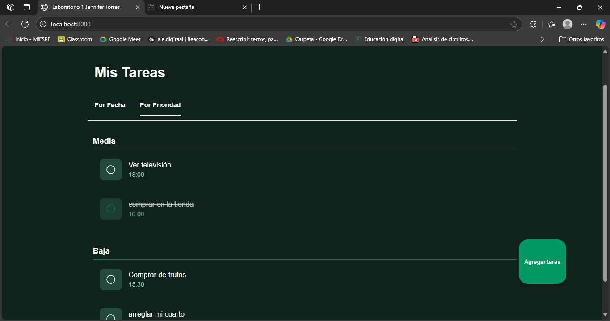

#  ESPE Tasks - Aplicación Web de Gestión de Tareas

**ESPE Tasks** es una aplicación web desarrollada con **LitElement** que permite gestionar tareas diarias de forma moderna y visual. Esta app está diseñada como un laboratorio de la asignatura **Programación Integrativa de Componentes** (202550 - Nivel 6), utilizando componentes web personalizados, encapsulados y reutilizables.

>  Proyecto desarrollado por: **Jennifer Nayelu Torres Moreta**  
>  Fecha: 04 de julio de 2025

---
## 🖼️ Captura de ejecución

##  Funcionalidades Principales

-  **Agregar nueva tarea** con nombre, notas, hora, fecha y prioridad.
-  **Editar tareas existentes** desde la vista de detalle o lista.
-  **Marcar tareas como completadas** con efectos visuales.
-  **Eliminar tareas** con confirmación para evitar errores.
-  **Visualizar detalles completos** de cada tarea en un modal.
-  **Agrupación dinámica** por fecha o prioridad.
-  **Soporte de temas oscuro y claro** con variables CSS personalizables.
-  **Diseño responsivo** adaptado a pantallas pequeñas.

---

##  Tecnologías Usadas

- **LitElement**: Base para la creación de componentes web modernos.
- **JavaScript (ES Modules)**: Para la organización de la lógica por archivos.
- **CSS Variables + Shadow DOM**: Encapsulamiento de estilos y diseño dinámico.
- **Webpack**: Para bundling y desarrollo local.
- **HTML5**: Marcado semántico moderno.

---

##  Estructura de Componentes

Tu proyecto está compuesto por componentes reutilizables que siguen una arquitectura basada en módulos:

| Componente         | Función Principal |
|--------------------|------------------|
| `<espe-item>`      | Muestra una tarea individual con icono, hora y acciones. |
| `<espe-list>`      | Agrupa y organiza todas las tareas por fecha o prioridad. |
| `<espe-detail>`    | Muestra un modal con detalles completos de una tarea. |
| `<espe-form>`      | Permite crear o editar tareas con validaciones. |
| `<espe-header>`    | Encabezado institucional de la app (opcional). |

---

##  Ventajas del Proyecto

-  **Componentización completa** con LitElement, ideal para proyectos modernos.
-  **Reutilizable** y escalable, gracias al uso de módulos y slots.
-  **Estilos personalizables** usando variables CSS e integración con temas.
-  **Separación de responsabilidades**: cada componente maneja su propia lógica y vista.
-  **Interfaz amigable** e intuitiva, pensada tanto para escritorio como móviles.

---

##  Instrucciones para Ejecutar Localmente

### 1. Clona el repositorio
```bash
git clone https://github.com/Jntorres2001/Lab1U2.git
```
### 2. Instala las dependencias
```bash
npm install
```
### 3. Inicia el servidor
```bash
npm run serve
```
4. Abre tu navegador en:
```bash
http://localhost:8080
```

## Posibles Mejoras Futuras

* Integrar almacenamiento con IndexedDB o LocalStorage.

* Autenticación básica para múltiples usuarios.

* Filtro por tareas completadas y no completadas.

* Soporte para subtareas o categorías.