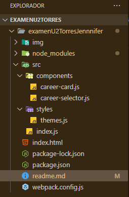

# Examen LitElement: Componentes de Carreras ESPE

---

## Autora

**Jennifer Nayeli Torres Moreta**
---
**Cedula:235039474-4**
## Descripción

Este proyecto es una aplicación interactiva desarrollada con LitElement que implementa dos Web Components personalizados para mostrar información sobre las carreras de la Universidad de las Fuerzas Armadas ESPE.

- `<career-selector>`: Muestra una lista de carreras y permite seleccionar una.
- `<career-card>`: Muestra la información detallada de la carrera seleccionada, aplicando un tema de color basado en el último dígito de la cédula de identidad.

En mi caso, con la cédula **2350394744**, el último dígito es **4**, por lo que el tema aplicado es **Rojo** (energía, mecatrónica).

La comunicación entre ambos componentes se realiza mediante eventos personalizados, haciendo la aplicación dinámica y modular.

---


## Estructura del Proyecto



## Temas de colores aplicados (según último dígito de cédula)

| Último dígito | Tema    | Descripción                  |
|---------------|---------|------------------------------|
| 0 - 1         | Azul    | Colores institucionales      |
| **4 - 5**     | <span style="color:red; font-weight:bold;">Rojo (seleccionado)</span> | **Energía, mecatrónica**     |
| 6 - 7         | Gris    | Tecnología, software         |
| 8 - 9         | Naranja | Innovación, emprendimiento   |

---

## Uso y configuración
- El componente <career-selector> muestra una lista con al menos 4 carreras de la ESPE.

- Al seleccionar una carrera, despacha un evento personalizado career-selected con la información de la carrera.

- El componente <career-card> escucha ese evento y actualiza su contenido mostrando nombre, facultad, descripción breve e imagen de la carrera.

- Se aplica un tema de color dinámico al <career-card> según el último dígito de la cédula (en mi caso, rojo).
## Tabla de propiedades y evento
| Componente          | Propiedad / Evento       | Tipo        | Descripción                                           |
| ------------------- | ------------------------ | ----------- | ----------------------------------------------------- |
| `<career-card>`     | `career`                 | Object      | Objeto con datos de la carrera a mostrar              |
| `<career-selector>` | Evento `career-selected` | CustomEvent | Evento con datos completos de la carrera seleccionada |

## Instrucciones para clonar y ejecutar el proyecto

1. Clonar el repositorio:
```bash
https://github.com/Jntorres2001/espe-career-components-exam-JenniferTorres.git
```
2. Instalar dependencias::
```bash
npm install

```
2. Iniciar servidor de desarrollo:
```bash
npm run serve
```
2. Abrir en el navegador:
```bash
 http://localhost:8000
```
## Vista previa
